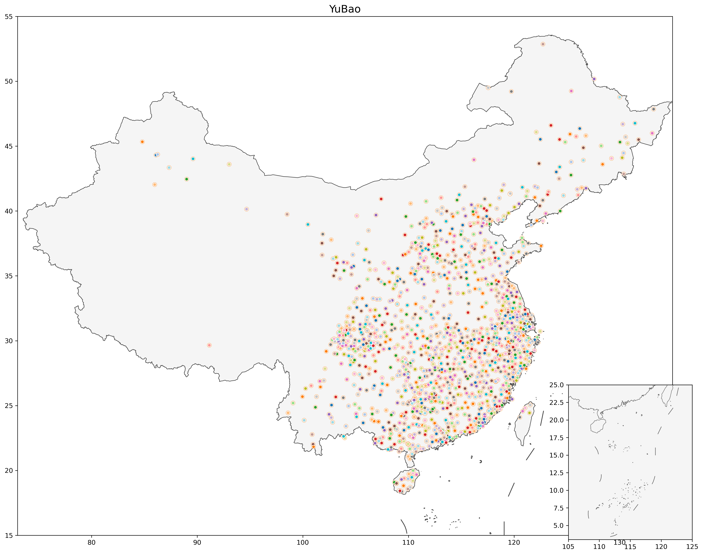

# Overview

In this project, we release the most diverse and comprehensive features for hundreds of Sinitic dialects from large-scale transcription and raw waves to faciliate further research in language variation/classification/evolution or related domains like Economics as references.

You can use the [load.py](load.py) to load representations directly.

## 0. Data Used

We collected raw speech ('Data2'), transcription ('Data4'), categorical annotation ('Data3') and historical information('Data1'). For each dataset, we apply clear and consistent preprocessing. Below is detailed introduction.

**表 1: 数据集概览**
| 标识  | 内容  | 规模  |  特征  | 来源 |
|--------------|--------------------------------------|-------------------------------------------------------------------------|---------------------------------------------|----------|
| `Data 1` | 中古音韵 | 3804字，表格  |          | closed source |
| `Data 2` | 汉语方言音频 | 827GB音频  |  原始语音特征  | closed source |
| `Data 3` | 《汉语方言地图集》 | 表格  |  语音、词汇、语法特征  | [^huang2024][^yang2024] |
| `Data 4` | 中国语言资源保护工程  |  1289地1000词的表格  |  声母、韵母、声调特征  | [^1] |

[^1]: <https://zhongguoyuyan.cn/index>
[^huang2024]: Huang, H., Grieve, J., Jiao, L., & Cai, Z. (2024). Geographic structure of Chinese dialects: a computational dialectometric approach. Linguistics, 62(4), 937-976.
[^yang2024]: Yang, C., Zhang, X., Yan, S., Yang, S., Wu, B., You, F., ... & Zhang, M. (2024). Large-scale lexical and genetic alignment supports a hybrid model of Han Chinese demic and cultural diffusions. Nature Human Behaviour, 8(6), 1163-1176.
[^zhang2019]: Zhang, M., Yan, S., Pan, W., & Jin, L. (2019). Phylogenetic evidence for Sino-Tibetan origin in northern China in the Late Neolithic. Nature, 569(7754), 112-115.


## Data2: Speech Representations 

## Data3: Phonology, Lexicon, Syntax Representations

<div align="center">

<b><br>Dialect Locations for Data3</b>
</div>


## Data4: Initial, Final, and Tone Representations

<div align="center">

<b><br>Fig 4.1: Original Dialect Locations for Data4</b>
</div>


### 4.1: Raw Transcription Loading

As seen in Fig 4.1, the raw dataset contains 1289 Sinitic dialects. For each dialect, linguists investigate 1000 words.

You can load the original transcription data and related metadata using the `load_feats` function in `load.py`. Specifically, use `type='raw'` to get this initial set of data:

```python
raw_data_dict = load_feats(name='Data4', type='raw')
```

Running this command will typically show loading progress or information similar to this output:

```text
正在从文件 'Data4/transcription_areas.pkl' 加载数据...
计划加载的特征: ['word_name', 'area', 'slice', 'slices', 'coords', 'initial', 'final', 'tone']
成功加载 8 个特征。
```

The `raw_data_dict` dictionary will contain the following keys, corresponding to the loaded features:

* **Original Transcriptions:**
    * `initial`: Original transcription of initials. (`numpy` array, shape `[1289, 999]`, string type)
    * `final`: Original transcription of finals. (`numpy` array, shape `[1289, 999]`, string type)
    * `tone`: Original transcription of tones. (`numpy` array, shape `[1289, 999]`, string type)
    * *Note:* The second dimension is 999 instead of 1000 because the word '0053 瓦' is fully missing across all 1289 dialects in the original data source for these transcription features.

* **Locations and Classifications:**
    * `word_name`: A list or array of the 1000 words being investigated (including a placeholder or indicator for '0053 瓦').
    * `area`: Classification of dialect areas.
    * `slice`, `slices`: Further classifications or groupings of these areas.
    * `coords`: Geographic coordinates for each dialect.

You can then access the individual data components using the dictionary keys, for example:

```python
initials_data = raw_data_dict['initial']
dialect_locations = raw_data_dict['coords']
```

### 4.2: Distance Matrix Loading