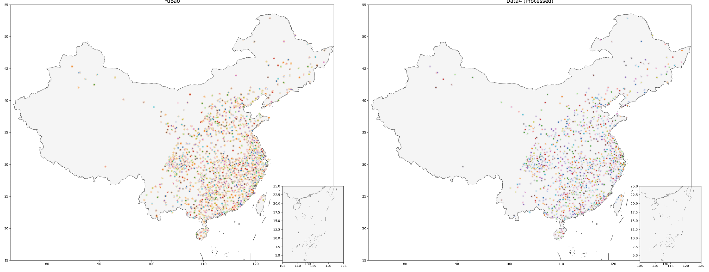

# Overview

In this project, we release the most diverse and comprehensive features for hundreds of Sinitic dialects from large-scale transcription and raw waves to faciliate further research in language variation/classification/evolution or related domains like Economics as references.

You can use the [load.py](load.py) to load representations directly.

## 0. Data Used

We collected raw speech ('Data2'), transcription ('Data4'), categorical annotation ('Data3') and historical information('Data1'). For each dataset, we apply clear and consistent preprocessing. Below is detailed introduction.

**表 1: 数据集概览**
| 标识  | 内容  | 规模  |  特征  | 来源 |
|--------------|--------------------------------------|-------------------------------------------------------------------------|---------------------------------------------|----------|
| `Data 1` | 中古音韵 | 3804字，表格  |          | closed source |
| `Data 2` | 汉语方言音频 | 827GB音频  |  原始语音特征  | closed source |
| `Data 3` | 《汉语方言地图集》 | 表格  |  语音、词汇、语法特征  | [^huang2024][^yang2024] |
| `Data 4` | 中国语言资源保护工程  |  1289地1000词的表格  |  声母、韵母、声调特征  | [^1] |

[^1]: <https://zhongguoyuyan.cn/index>
[^huang2024]: Huang, H., Grieve, J., Jiao, L., & Cai, Z. (2024). Geographic structure of Chinese dialects: a computational dialectometric approach. Linguistics, 62(4), 937-976.
[^yang2024]: Yang, C., Zhang, X., Yan, S., Yang, S., Wu, B., You, F., ... & Zhang, M. (2024). Large-scale lexical and genetic alignment supports a hybrid model of Han Chinese demic and cultural diffusions. Nature Human Behaviour, 8(6), 1163-1176.
[^zhang2019]: Zhang, M., Yan, S., Pan, W., & Jin, L. (2019). Phylogenetic evidence for Sino-Tibetan origin in northern China in the Late Neolithic. Nature, 569(7754), 112-115.

## 1. Automatic Labeling Area & Slice

We digitalize 《中国方言地图集》23 maps and use a Vision-language model to phrase it, along with a langauge model for documentng. Then, we establish a AI Agent with RAG. This system could automatically label dialects to their corresponding area and slices.

## Data2: Speech Representations 

### 2.1 MFCCs-Based Features

We use MFCCs to extract a 39-dimensional represenatation from audio every 10 ms. Then, we use mean, GMM + ivecors to map each area/slice a representation. You can load these representations easily with: 

```python
representation = load_feats(name='Data2', type='mfccs-mean') #gmm
info = load_feats(name='Data2', type='info')
```

### 2.2 Pretrained Speech Models


## Data3: Phonology, Lexicon, Syntax Representations

<div align="center">

<b><br>Fig 3. Dialect Locations for Data3</b>
</div>

As seen in Fig 3 (left), the raw dataset contains 930 Sinitic dialects. For each dialect, linguists documentated 205 phonology、203 lexicon and 102 syntax maps.

You can load the distance matrix and related coordinates using the `load_feats` function in `load.py`. Specifically, use `type='distance_matrices'` and `type='info'`  to get this initial set of data:

```python
distance_matricas = load_feats(name='Data4', type='distance_matrices')
info = load_feats(name='Data3', type='info')
```

Running this command will typically show loading progress or information similar to this output:

```text
正在从文件 'Data3/distance_matrices.npz' 加载数据...
计划加载的特征: ['lexicon_distance', 'phonology_distance', 'syntax_distance', 'overall_distance']
成功加载 4 个特征。

正在从文件 'Data3/info.npz' 加载数据...
计划加载的特征: ['coords']
成功加载 1 个特征。
```

## Data4: Initial, Final, and Tone Representations

<div align="center">

<b><br>Fig 4: (Left) Original 1289 Dialect Locations for Data4; (Right) 1084 Dialect Locations for Processed Data4</b>
</div>


### 4.1: Raw Transcription Loading

As seen in Fig 4 (left), the raw dataset contains 1289 Sinitic dialects. For each dialect, linguists investigate 1000 words.

You can load the original transcription data and related metadata using the `load_feats` function in `load.py`. Specifically, use `type='raw'` to get this initial set of data:

```python
raw_data_dict = load_feats(name='Data4', type='raw')
```

Running this command will typically show loading progress or information similar to this output:

```text
正在从文件 'Data4/transcription_areas.pkl' 加载数据...
计划加载的特征: ['word_name', 'area', 'slice', 'slices', 'coords', 'initial', 'final', 'tone']
成功加载 8 个特征。
```

The `raw_data_dict` dictionary will contain the following keys, corresponding to the loaded features:

* **Original Transcriptions:**
    * `initial`: Original transcription of initials. (`numpy` array, shape `[1289, 999]`, string type)
    * `final`: Original transcription of finals. (`numpy` array, shape `[1289, 999]`, string type)
    * `tone`: Original transcription of tones. (`numpy` array, shape `[1289, 999]`, string type)
    * *Note:* The second dimension is 999 instead of 1000 because the word '0053 瓦' is fully missing across all 1289 dialects in the original data source for these transcription features.

* **Locations and Classifications:**
    * `word_name`: A list or array of the 1000 words being investigated (including a placeholder or indicator for '0053 瓦').
    * `area`: Classification of dialect areas.
    * `slice`, `slices`: Further classifications or groupings of these areas.
    * `coords`: Geographic coordinates for each dialect.

You can then access the individual data components using the dictionary keys, for example:

```python
initials_data = raw_data_dict['initial']
dialect_locations = raw_data_dict['coords']
```


### 4.2 Data Processing and Distance Matrix Calculation


Before calculating dialect distances, the raw transcription data undergoes a processing step to handle missing and potentially unreliable values.

The criteria for setting a transcription as a missing value were:
* The transcription was marked as 'wrong' in the original data.
* The specific transcription (of an initial, final, or tone) appeared less than 1000 times across the entire dataset, indicating low frequency and potential unreliability.

After marking these values as missing, we filtered both the dialects (rows) and the words (columns). We kept only those dialects and words where the proportion of **missing values was less than 30%**.

Following this filtering operation, the dataset was reduced to **1084 dialects** (rows) and **915 words** (columns).

Subsequently, dialect distance matrices were calculated pairwisely based on the remaining **915 features** (words). Separate distance matrices were computed for:
* Initials (`initials_distance`)
* Finals (`finals_distance`)
* Tones (`tones_distance`)
* An overall combined distance (`overall_distance`)

Each resulting distance matrix has a shape of `[1084, 1084]`.

You can load these distance matrices using the `load_feats` function with `type='distance_matrices'`:

```python
distance_matrices_dict = load_feats(name='Data4', type='distance_matrices')

# Example: Access the initials distance matrix
initial_distance_matrix = distance_matrices_dict['initials_distance']

# You can similarly access 'finals_distance', 'tones_distance', and 'overall_distance'
# final_distance_matrix = distance_matrices_dict['finals_distance']
# etc.
```

Simultaneously, you can load the associated metadata (such as coordinates, areas, and classifications) for the **filtered dialects** using `type='info'`:

```python
info_dict = load_feats(name='Data4', type='info')

# Access the associated metadata for the 1084 kept dialects
coords_data = info_dict['coords']
areas_data = info_dict['areas']
slice_data = info_dict['slice']
slices_data = info_dict['slices']
word_names_data = info_dict['word_names'] # Note: word_names is also included in 'info'
```